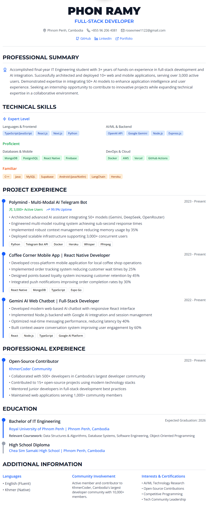

# Resume Template Design

A modern, responsive resume template built with Next.js, React, and Tailwind CSS. This project showcases a professional resume layout with clean typography, interactive elements, and a mobile-first design approach.

[](https://nextjs.org/)
[](https://reactjs.org/)
[](https://www.typescriptlang.org/)
[](https://tailwindcss.com/)

## 🌟 Features

- **Modern Design**: Clean, professional layout with elegant typography
- **Responsive Layout**: Optimized for desktop, tablet, and mobile devices
- **Interactive Elements**: Hover effects and smooth transitions
- **Accessible**: Built with accessibility best practices
- **Fast Performance**: Optimized with Next.js for lightning-fast loading
- **Customizable**: Easy to modify content and styling
- **Component-Based**: Reusable UI components with shadcn/ui

## 🚀 Tech Stack

- **Framework**: Next.js 15.2.4
- **Frontend**: React 19 with TypeScript
- **Styling**: Tailwind CSS 4.1.9
- **UI Components**: shadcn/ui with Radix UI primitives
- **Icons**: Lucide React
- **Fonts**: Geist font family
- **Deployment**: Vercel

## 📦 Project Structure

```
├── app/                    # Next.js app directory
│   ├── globals.css        # Global styles
│   ├── layout.tsx         # Root layout component
│   └── page.tsx           # Main resume page
├── components/            # Reusable UI components
│   ├── ui/               # shadcn/ui components
│   └── theme-provider.tsx # Theme provider
├── hooks/                # Custom React hooks
├── lib/                  # Utility functions
├── public/               # Static assets
│   ├── Icon.png          # Profile/brand logo
│   └── placeholder-*     # Placeholder images
└── styles/               # Additional stylesheets
```

## 🛠️ Installation & Setup

1. **Clone the repository**

   ```bash
   git clone https://github.com/remy2404/resume-template-design.git
   cd resume-template-design
   ```

2. **Install dependencies**

   ```bash
   pnpm install
   # or
   npm install
   # or
   yarn install
   ```

3. **Run the development server**

   ```bash
   pnpm dev
   # or
   npm run dev
   # or
   yarn dev
   ```

4. **Open your browser**
   Navigate to [http://localhost:3000](http://localhost:3000) to see your resume.

## 🎨 Customization

### Personal Information

Edit the personal details in `app/page.tsx`:

- Name and title
- Contact information
- Social media links
- Professional summary

### Styling

- **Colors**: Modify the color scheme in `tailwind.config.js`
- **Typography**: Update font families and sizes in the CSS files
- **Layout**: Adjust spacing and layout in the component files

### Content Sections

The resume includes the following customizable sections:

- Professional Summary
- Technical Skills (Expert, Proficient, Familiar levels)
- Project Experience
- Professional Experience
- Education
- Additional Information

## 📱 Responsive Design

The template is fully responsive and optimized for:

- **Desktop**: Full-width layout with multi-column sections
- **Tablet**: Adapted layout with appropriate spacing
- **Mobile**: Single-column layout with touch-friendly elements

## 🚀 Deployment

### Vercel (Recommended)

1. Push your code to GitHub
2. Connect your repository to Vercel
3. Deploy automatically with every push

### Other Platforms

```bash
# Build for production
pnpm build

# Start production server
pnpm start
```

## 🤝 Contributing

Contributions are welcome! Please feel free to submit a Pull Request.

1. Fork the project
2. Create your feature branch (`git checkout -b feature/AmazingFeature`)
3. Commit your changes (`git commit -m 'Add some AmazingFeature'`)
4. Push to the branch (`git push origin feature/AmazingFeature`)
5. Open a Pull Request

## 📄 License

This project is open source and available under the [MIT License](LICENSE).

## 📞 Support

If you have any questions or need help customizing the template, feel free to:

- Open an issue on GitHub
- Reach out via email: rosexmee1122@gmail.com
- Connect on [LinkedIn](https://www.linkedin.com/in/phon-ramy-81025a2a9/)
